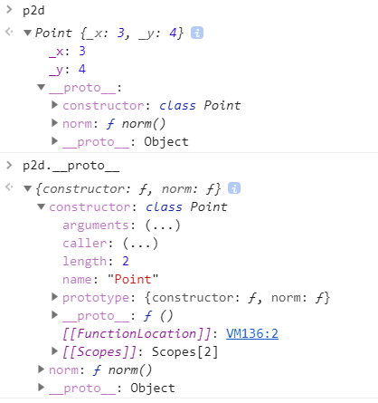

### 问答题
##### 1. ES6中的class其本质是es5声明类的方式的语法糖吗？请从原型链方面证明你的想法
是，从语法糖角度来说，class的引入简化了类的使用，避免了使用原型链的方式声明类，对开发人员友好。
从原型链的角度来说，定义下面的类
```javascript
class Point{
    constructor(x, y){
        this._x = x
        this._y = y
    }
    norm(){
        return Math.sqrt(this._x*this._x+this._y*this._y)
    }
}
let p2d = new Point(3, 4)
```
在chrome中执行后发现与ES5中function定义类的方法是一样的。在ES6中定义的类，即class，就是该类的prototype中的constructor。

##### 2. ES6中的类构造函数如何声明？
```javascript
class Point{
    constructor(x, y){
        this._x = x
        this._y = y
    }
}
```
##### 3. ES6实现类private方法有几种形式？各是什么？
第一种方式可以采用在方法名前加下划线的方式，但是这是一种伪private的方法，只是开发者默认不调用此类方法，但是实际上是可以调用的。
第二种方式可以采用Symbol的方法：
```javascript
let bar = Symbol('bar');

class myClass{
  [bar](x) {
    return x;
  }
};
```
##### 4. 如何声明类的get，set方法？何时会调用get、set方法？
声明如下：
```javascript
class Point{
    constructor(x){
        this._x = x
    }
    get x(){
        return this._x
    }
    set x(val){
        this._x = val
    }
```
当需要获取属性的时候用get，需要修改属性值时用get。
##### 5. 什么是类的静态方法？如何声明？如何调用？
静态方法是可以不需要实例化类就能调用的方法。声明静态方法只需要在函数名前加关键字static。调用时候不需要创新一个对象，直接用类名.静态方法就可以调用。
##### 6. ES6 中如何进行继承？子类的构造函数中如何调用父类的构造函数？
使用extends关键字调用，super函数可以使子类的构造函数何调用父类的构造函数，例如：
```javascript
class Animal{
    constructor(name){
        this._name = name
    }
}
class Dog extends Animal{
    constructor(name, age){
        super(name)
        this._age = age
    }
}
```
##### 7. ES6 的模块中如何导入导出变量？
使用export和import关键字。export命令用于规定模块的对外接口，import命令用于输入其他模块提供的功能。
##### 8. ES6 的模块export default和export有何异同？
如果在导出变量时声明了default，那么在import时候可以不指定接收对象。
##### 9. 修饰器（Decorator）是什么？如何使用？
装饰器是一种与类相关的语法，用来注释或修改类和类方法。装饰器是一种函数，写成@ + 函数名。它可以放在类和类方法的定义前面。

---
### 代码题
##### 1. 请写出与下面 ES5 代码等价的 ES6 代码
```javascript
function Point(x, y) {
   this.x = x;
   this.y = y;
}

Point.prototype.toString = function () {
   return '(' + this.x + ', ' + this.y + ')';
};

var p = new Point(1, 2);
```
等价的ES6代码为：
```javascript
class Poitn{
    constructor(x, y){
        this.x = x
        this.y = y
    }
    toString(){
        return '(' + this.x + ', ' + this.y + ')';
    }
}

var p = new Point(1, 2);
```
##### 2. 请实现Circle类，其表示平面上的一个圆，构造时需要传入 x,y,r 分别为圆在平面上的坐标 (x,y）和其半径 r，需要支持使用 circle.area 获取圆的面积
```javascript
class Circle{
    constructor(x, y, r){
        this._x = x
        this._y = y
        this._r = r
    }
    get area(){
        return Math.PI*this._r*this._r
    }   
}
```
##### 3. 假定我们的代码中需要4个类，分别是 Animal，Dog，Cat，Human。Animal 有方法 eat,sleep;Dog,Cat有方法bark；Human有方法speak；请使用 ES6 中的继承实现。
```javascript
class Animal{
    constructor(name){
        this.name = name;
    }
    eat(){
        console.log(this.name + " can eat!");
    }
    sleep(){
        console.log(this.name + " can sleep!");
    }
}

class Dog extends Animal{
    constructor(name, age){
        super(name);
        this.age = age;
    }
    bark(){
        console.log(this.name + " can bark!");
    }
}

class Cat extends Animal{
    constructor(name, age){
        super(name);
        this.age = age;
    }
    bark(){
        console.log(this.name + " can bark!");
    }
}

class Human extends Animal{
    constructor(name, age){
        super(name);
        this.age = age;
    }
    speak(){
        console.log(this.name + " can bark!");
    }
}


let animal = new Animal("animal");
let dog = new Dog("dog");
let cat = new Cat("cat");
let human = new Human("human");

animal.eat();
animal.sleep();

dog.eat();
dog.sleep();
dog.bark();

cat.eat();
cat.sleep();
cat.bark();

human.eat();
human.sleep();
human.speak();
```