### 问答题
##### 1. 了解什么是域，假设当前显示页面地址为 http://bbs.mafengshe.com/a/b.html
1)http://bbs.mafengshe.com/a/b/c.html 成功
2)http://bbs.mafengshe.com/a.html 成功
3)http://bbs.mafengshe.com/pic.png 成功
4)https://bbs.mafengshe.com/a/b.html 失败，不同协议
5)http://bbs.mafengshe.com:81/a/b.html 失败，端口不同
6)http://work.mafengshe.com/a/b.html 失败，域不同
7)http://mafengshe.com/a/b/c.html 失败，域不同
8)file:///a/b.html 失败，不同协议
##### 2. 是什么原因造成直接跨域访问失败？
出于安全的考虑，浏览器同源策略会限制来自不同域名、协议、端口（不同的域）资源之间的访问。
##### 3. 跨域有哪几种方法？他们的原理各是什么？各有什么局限性？（如果有的话）
需要回答四种跨域方法
1）降域：如果当前域和要访问的域名有相同的父域，可以通过降域的方法来实现跨域。
2）document.name：在一个窗口的生命周期内,窗口载入的所有的页面（甚至不同域名）都是共享一个window.name的，每个页面对window.name都有读写的权限，所以我们可以通过window.name在不同域间传递信息。
3）JSONP：用 \<script> 元素的这个开放策略，网页可以得到从其他来源动态产生的 JSON 资料。
4）跨域资源共享（CORS）：CORS就是使用自定义的HTTP头部让浏览器与服务器进行沟通，从而决定请求或响应是成功还是失败。
##### 4. 测试服务器端接口可以使用什么工具？如何模拟请求那？截图附上工具使用截图，并发几个请求试一试
使用Postman，使用postman发送GET请求如下：
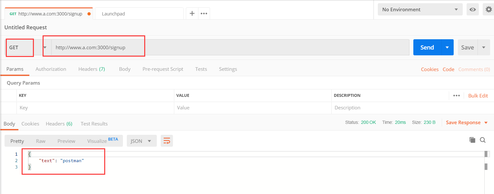
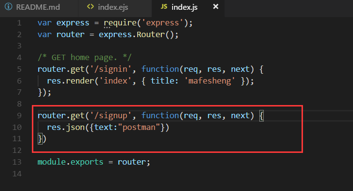
##### 5. 本地如何模拟跨域访问？请演示并截图
1)首先构造一个跨域访问的环境。先开启静态服务器，并修改host文件如下：
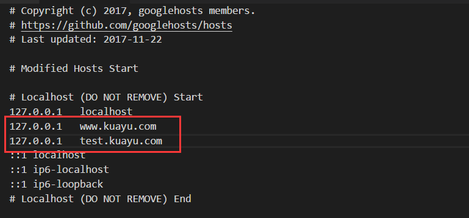
新建一个index.html文件如下：
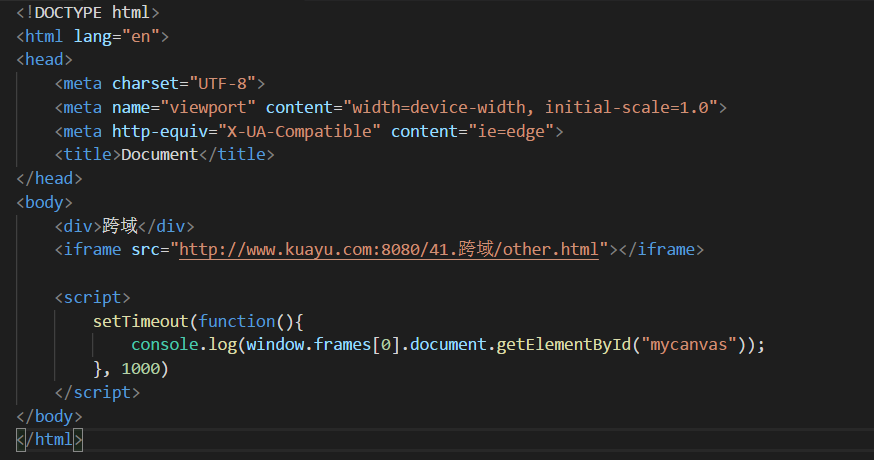
在域www.kuayu.com下打开index.html文件，访问www.kuayu.com下的other.html文件，可以正常访问：
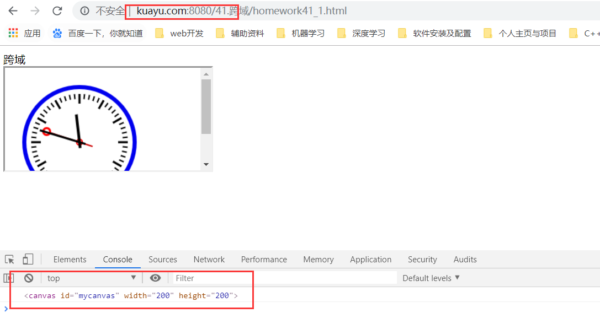
在域test.kuayu.com下打开index.html文件，访问www.kuayu.com下的other.html文件，不能正常访问：
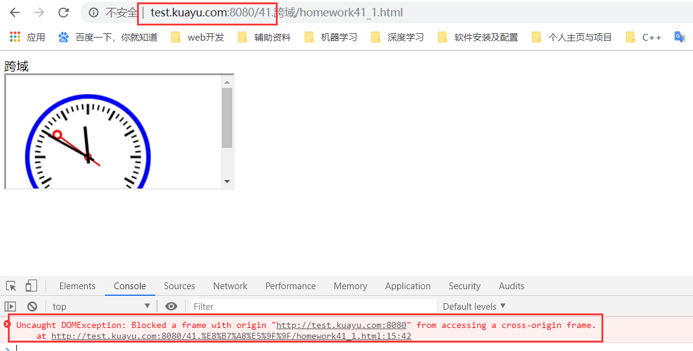
由此，跨域条件已构成，现在通过降域的方法实现跨域。
2）将index.html和other.html文件下分别加入：
document.domain = "kuayu.html"
同时修改hosts文件如下：
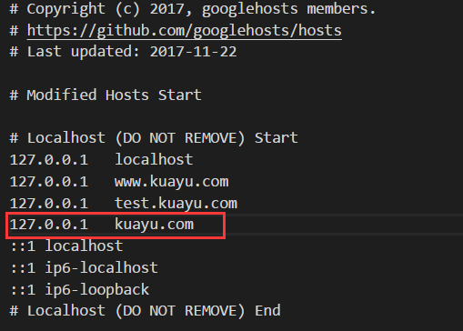
再次在域test.kuayu.com下打开index.html文件，访问www.kuayu.com下的other.html文件，可以正常访问，实现了跨域：
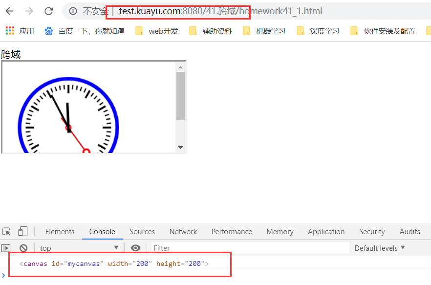

---
### 代码题
主要修改的是views/index.ejs和routes/index.js
其中views/index.ejs地址为：https://github.com/PangYunsheng8/mfs-senior/blob/master/2.%E8%B7%A8%E5%9F%9F/cross/views/index.ejs
routes/index.js地址为：
https://github.com/PangYunsheng8/mfs-senior/blob/master/2.%E8%B7%A8%E5%9F%9F/cross/routes/index.js

解释：1)代码调试完毕后，在浏览器中以http://www.a.com:3000/向www.b.com域发请求，请求内容为：434497112@qq.com
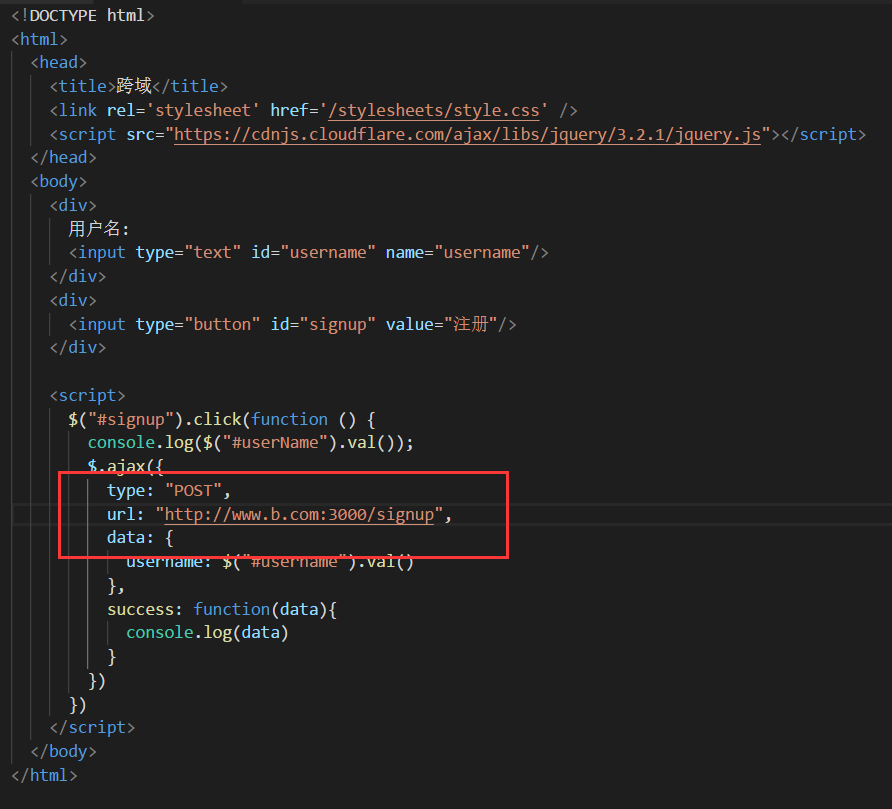
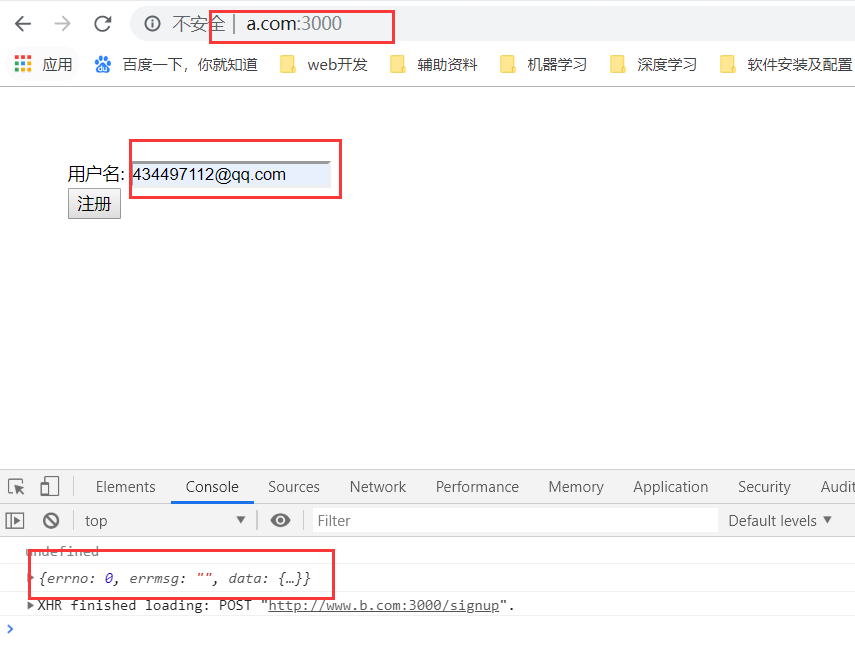
2)再在浏览器中以http://www.a.com:3000/向www.b.com域发请求，请求内容为：mafengshe
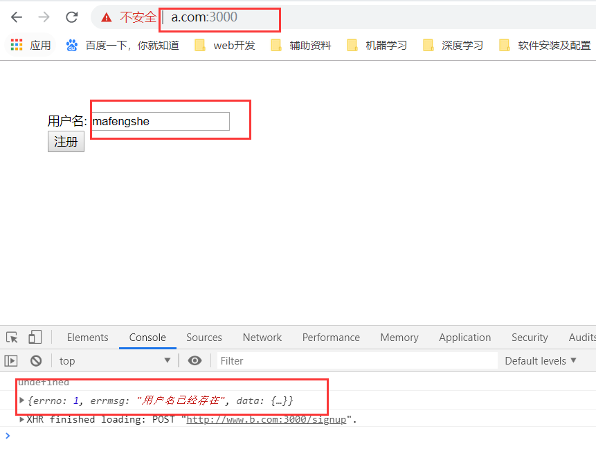

