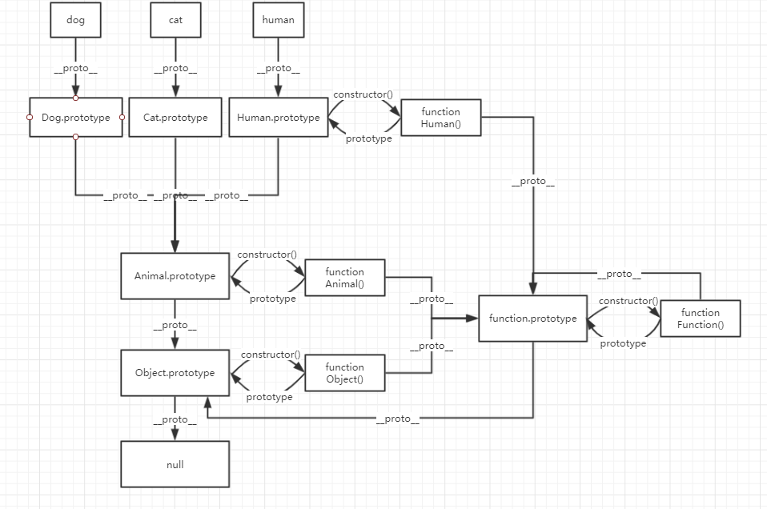

### 问答题
##### 1. js中对象的属性查找机制是什么？请写出实现属性查找机制的伪代码
js属性查找首先查找自身属性，如果没有，是顺着__proto__不断向上查找，直到查找到null为止
```javascript
findProperty(obj,property){
    if(obj.hasOwnProperty(property)){
        return obj[property];
    }
    var __proto__ = obj.__proto__;
    while(__proto__){
        if(__proto__.hasOwnProperty(property)){
            return __proto__[property]
        }
        __proto__ = __proto__.__proto__;
    }
    return undefined
}
```
##### 2. 自学ES5的 Object.create() 函数，然后用自己的代码重新实现
```
子类.prototype.__proto__ = 父类.prototype
```
##### 3. 使用原型链实现继承，本质通过改变对象的什么，来实现继承？
通过改变子类的prototype的__proto__为父类的prototype来实现继承。
##### 4. 当我们使用new关键字，其背后干了哪些事？
```javascript
var book = Book.call(
    {},       
    "book1", 
    "Tom",
    "59.9"
    )

book.__proto__ = Book.prototype;
```
首先调用了一个call函数，并把创建的对象的参数传入，其次，最关键的在于将对象(book)的__proto__指向类(Book)的prototype。
##### 5. 讲义中使用 Book.prototype = new Goods() 实现继承有什么不完美的地方？
1）无法传入参数，因为参数只有在调用时才知道
2）无法在构造器中为子类增加新的属性
##### 6. 画出代码题1的原型图，需要画到null

---
### 代码题
代码：https://github.com/PangYunsheng8/mfs-homework/blob/master/46.%E5%8E%9F%E5%9E%8B%E9%93%BE/homework46.html